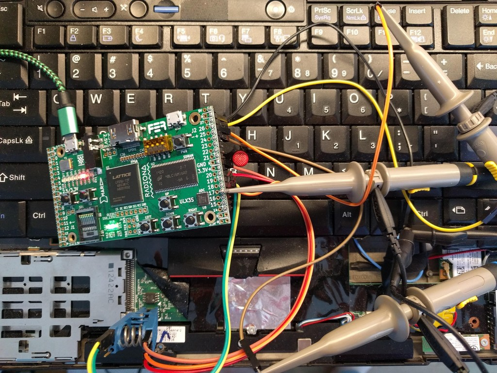
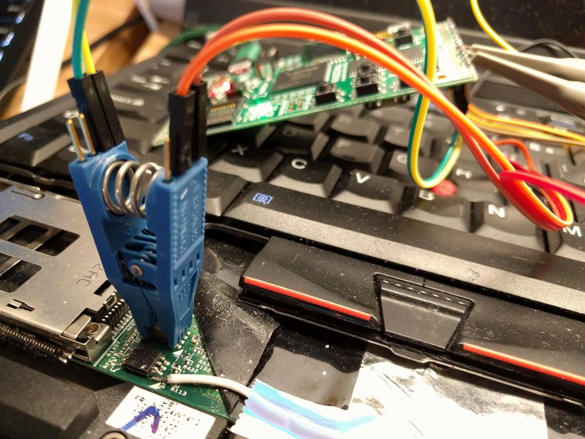
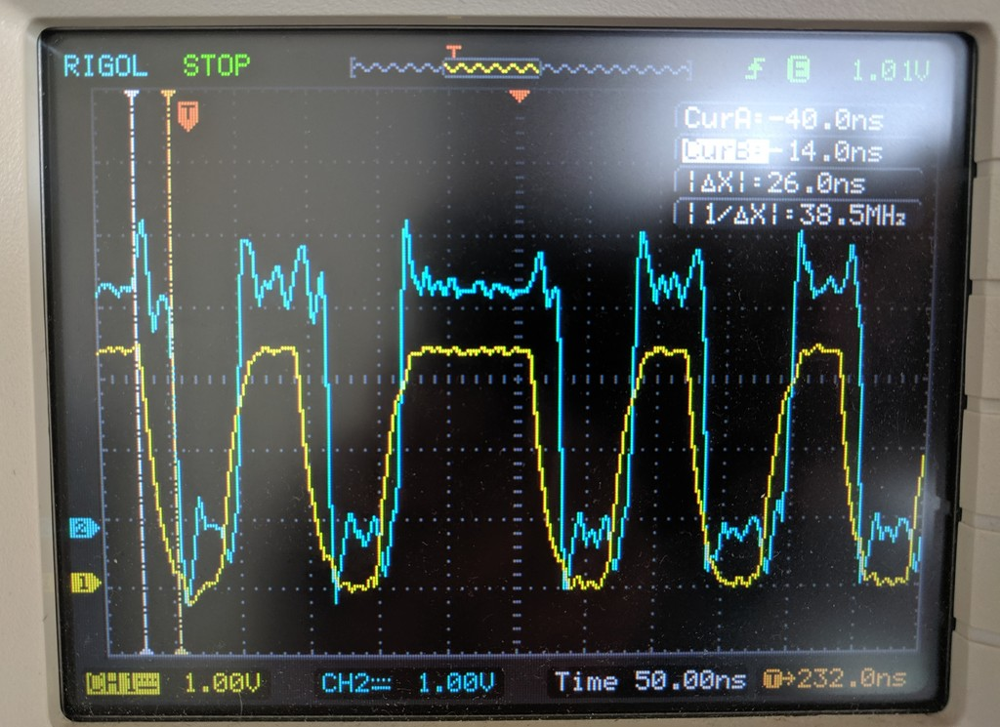
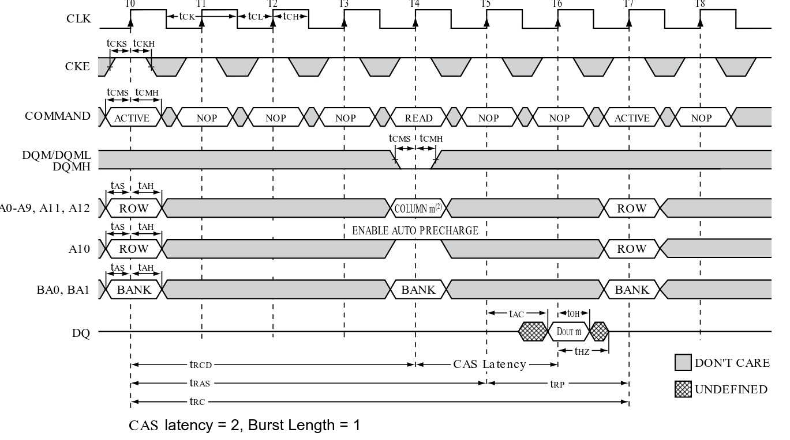

# SPI Spy: Flash emulation

The SPI Spy is an open source (both hardware and software)
SPI flash emulation tool.  It can store a flash image in the SDRAM
connected to the FPGA and serve the image to a host CPU over the
SPI bus.  This allows you to avoid the lengthy SPI flash erase/write
cycles during firmware development as well as to more easily explore
early boot time security against TOCTOU attacks.

## Platform
The design is currently based on the [ULX3S](https://radiona.org/ulx3s/)
which has an Lattice ECP5-12F FPGA and a 16-bit wide 32 MB SDRAM. It
might be portable to the TinyFPGA-EX or other open source ECP5 boards,
although it uses a custom SDRAM controller to be able to meet the
difficult timing requirements of the SPI flash protocol (described below).

## Supported features
* Single SPI up to 20 MHz clock
* 3-byte addressing (up to 16 MB of flash image)
* Serial port updates to the SDRAM (could be faster [issue #11](https://github.com/osresearch/spispy/issues/11)]
and could be better [issue #3](https://github.com/osresearch/spispy/issues/3))
* Logging flash access patterns (could be longer, [issue #5](https://github.com/osresearch/spispy/issues/5))
* TOCTOU changes to the flash image based on read patterns

## Not yet supported
* Dual- and Quad-SPI ([issue #1](https://github.com/osresearch/spispy/issues/1))
* Multiple `!CS` pins ([issue #7](https://github.com/osresearch/spispy/issues/7))
* Fast read command ([issue #1](https://github.com/osresearch/spispy/issues/1))
* Erase/Write emulation ([issue #12](https://github.com/osresearch/spispy/issues/12))
* SFDP pages ([issue #9](https://github.com/osresearch/spispy/issues/9))
* Status registers (partially supported, could be better)
* Block protection bits (maybe worth it, probably not)
* Linux RISC-V core in the FPGA
  * Serial port for console
  * Higher bandwidth programming over separate USB endpoint ([issue #11](https://github.com/osresearch/spispy/issues/11))
  * Default flash image on SD card
  * A decent API for TOCTOU exploration

# Wiring



Typical 8-SOIC and 8-DIP flash chips:

```
            +------+
    !CS  ---| o    |----  +V
     SO  ---|      |---- !RST
    !WP  ---|      |----  SCK
    GND  ---|      |----  SI
            +------+
```

If there is a series resistor on the `!CS` pin, it might be possible to clip
directly to the chip with a Pomona 8-SOIC "chip clip" and use TOCTOU mode to
override the signal from the PCH.  However, this doesn't always work so sometimes
it is necessary to desolder pin 1 from the board, bend the leg upwards and solder
a jumper wire to the pad on the maiboard as shown in the above photo.

If the board has a "Dediprog" or programming header it might be possible to attach
directly to the header and also override the chip select pin, although more
testing is necessary.

*IMPORTANT NOTE* the system currently uses 3.3v signalling for the SPI bus.
If you have more modern system, it _might_ use 1.8v and driving it at the higher
voltage can cause problems.  We need to test this and figure out if alternate
output voltages can be selected on the pins. ([issue #10](https://github.com/osresearch/spispy/issues/10))


# Protocol


The [SPI protocol](https://www.winbond.com/resource-files/w25q256fv_revg1_120214_qpi_website_rev_g.pdf)
is difficult to emulate without specialized hardware
since it has very demanding timing requirements.  The flash device
has no control over the clock and must be able to respond to a random
read request on the very next clock.  At 20 MHz, the slowest SPI bus
on some Intel PCH chipsets, this is 50ns from receiving the last bit of
the address to having to supply the first bit of the data.

Unfortunately, most microcontroller CPUs aren't able to respond to an
incoming SPI byte on the next SPI cycle due to internal muxes and buses,
so they aren't able to reply in time.  Even if the CPU could do it,
most DRAM memory has a 100ns or longer latency for a random read, so
it won't be able to answer quickly enough.  Additionally, DRAM requires
a refresh cycle that takes it offline during the refresh, which adds a
random latency.



These difficulties can be overcome with an FPGA using a custom DRAM
controller.  The FPGA is able to inhibit refresh cycles during the SPI
critical sections, which reduces the latency jitter, and it can split
the DRAM access into two parts: the "row activation" once 16 of the
24 address bits are known, and then a "column read" of two bytes worth 
of data once 7 of the last 8 bits are known.  The correct byte is selected
once the last bit of the address has been received.

The row activation command requires at least four DRAM clock cycles,
but can be stretched arbitrarily long with a special control signal wired
into the FPGA's sdram controller from the SPI bus interface.  This allows
the FPGA to overlap the activation with the reception of the last bits,
and the final column read requires only two clock cycles when the DRAM
is configured with a CAS latency of two.

Subsequent bytes are "easy" at 20 MHz for single SPI since the full
SDRAM read cycle (7 FPGA clocks) fits into the 8 clocks of the SPI bus
(roughly 24 FPGA clocks). For dual or quad-SPI it will be necessary
to configure a burst mode on the SDRAM controller or allow new column
addresses to be provided dynamically.
